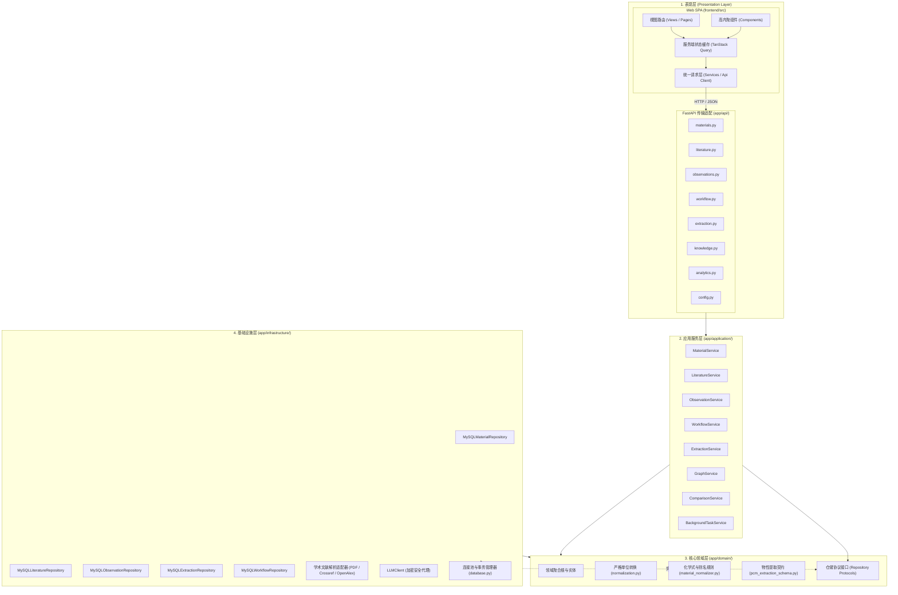
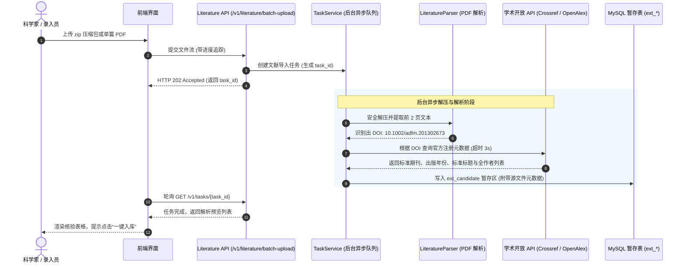
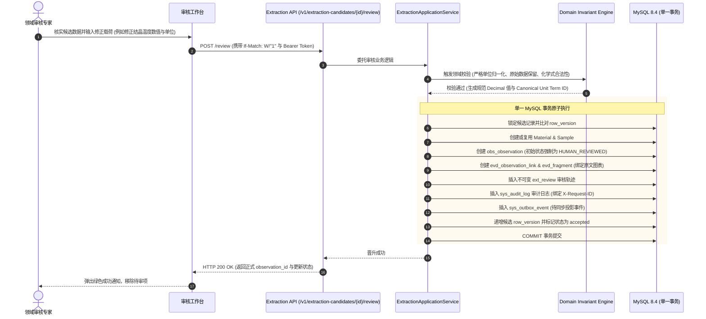

# PhaseChangeDB 架构与设计治理文档 v1 (Architecture & Governance Specification)

- **版本**：v1.0
- **日期**：2026-09-19
- **定位**：指导 PhaseChangeDB 代码重构、模块解耦、依赖方向约束与新功能扩展的架构规范。

---

## 1. 现状盘点与架构负债诊断

### 1.1 现状资产盘点
- **技术栈现状**：FastAPI 0.128+、Pydantic v2、SQLAlchemy 2.0 (Async) + asyncmy、MySQL 8.4 LTS (InnoDB)、React 19 + TypeScript + Vite + pnpm。
- **已实现链路**：
  - 人工录入工作流 `/v1/workflow/intake`（文献、材料、样品、测量、证据、观测单事务原子入库）；
  - AI 提取候选暂存 `/v1/extractions/candidates`（完全写入 `ext_*` 暂存表，绝不污染正式观测）；
  - 专家审核流 `/v1/extraction-candidates/{id}/review`（带 `If-Match: W/"<row_version>"` 乐观锁，支持 `accept` 晋升为 `HUMAN_REVIEWED` 与 `reject`）；
  - 观测生命周期状态机（`HUMAN_REVIEWED` $\rightarrow$ `VERIFIED` $\rightarrow$ `RETRACTED`）；
  - 细粒度知识图谱单节点关联子图（1/2/3 级关联展开）与物性横向对比看板；
  - 自适应免数据库演示模式（`PCM_DEMO_MODE=1`）与 Codespaces 支持。

### 1.2 关键架构异味与上帝类识别
通过对全仓代码库的静态审查，识别出以下严重的技术债务点：

1. **后端超级上帝类：`app/infrastructure/mysql_catalog.py`**
   - **代码规模**：**2242 行**，单一文件承担了 8 个正交业务领域的持久化与逻辑计算；
   - **职责杂糅**：
     - 材料领域：`list_materials()`, `get_material()`, `create_material()`, `get_existing_elements()`, `get_material_conflicts()`；
     - 文献领域：`list_papers()`, `create_paper()`, `get_paper()`, `batch_ingest_papers()`；
     - 观测与分析：`list_observations()`, `create_observation()`, `get_property_comparison()`（含动态四分位数与箱线图计算）；
     - 图谱拓扑：`get_knowledge_graph()`（包含巨型原生 SQL 拼接与内存邻接表组装）；
     - 统计分析：`get_literature_stats()`（年份、期刊、作者、体系统计）；
     - 系统配置：`get_config()`, `update_config()`；
     - 全文检索：`search()`（基于 MySQL `LIKE` 模糊匹配）。
   - **危害**：任何局部的 SQL 调整都可能导致其他无关端点回归故障；团队并行开发冲突率极高。

2. **前端巨型上帝组件：`frontend/src/App.tsx` & `App.css`**
   - **代码规模**：`App.tsx` 达 **2108 行**，`App.css` 达 **82 KB**；
   - **状态与逻辑耦合**：
     - 在一个顶层组件中维护了数十个 `useState`（全局搜索、周期表选择、过滤条件、材料详情抽屉、横向看板比对条件、图谱控制器、弹窗可见性）；
     - 各处子功能未拆分为路由页面，采用条件渲染大量嵌套；
     - 缺乏统一的 API 请求层：除了 `workflow.ts` 外，大部分网络请求都在组件内部直接手写 `fetch(`${API_BASE}/...`)`，缺少拦截器、统一错误 Toast 与状态复用。

3. **文献解析与业务逻辑硬编码耦合：`app/application/literature_parser.py`**
   - **代码规模**：**604 行**；
   - **实现机制**：直接使用手写正则表达式扫描 PDF 二进制字节流（寻找 `b"<x:xmpmeta"`, `/Title\s*\(`, `/Author\s*\(`）；
   - **缺陷**：对现代双栏排版、压缩流或扫描版 PDF 极易漏抽或报错；解压与解析在 HTTP 主线程同步执行，上传大包时极易导致网关超时。

4. **演示模式镜像维护债务：`app/demo/demo_provider.py`**
   - 为了支持免数据库演示，在 `demo_provider.py` 中全量镜像了 `mysql_catalog.py` 的方法签名；当后者新增或修改接口时，极易发生契约偏离。

---

## 2. 目标分层架构与依赖方向规范



### 核心依赖原则与红线（禁止违背）：
1. **单向依赖红线**：
   - 依赖关系仅能**从外向内**流动：`UI` $\rightarrow$ `API` $\rightarrow$ `Application` $\rightarrow$ `Domain` $\leftarrow$ `Infrastructure`（依赖反转）；
   - **绝对禁止反向依赖**：领域层（`domain`）不得导入任何 FastAPI、SQLAlchemy、数据库驱动、外部 HTTP 客户端或操作系统进程；
   - **路由层禁止内联 SQL**：API 路由必须且仅能负责 HTTP 协议参数解包、调用 Application Service、并返回 Pydantic 响应模型；严禁在 Router 中直接执行 SQL 或复杂业务判定。
2. **单一事实源与事务边界**：
   - MySQL 8.4/InnoDB 是系统唯一的权威事实源（System of Record）；
   - 领域业务操作、不可变审核历史（`sys_audit_log` / `ext_review`）以及异步事件（`sys_outbox_event`）必须在**同一个 MySQL 事务中原子提交**；
   - 外部派生投影（Elasticsearch 混合检索、Neo4j 图遍历）由 Outbox Worker 异步消费同步，投影不可用不得阻断主事务写入。

---

## 3. 目标目录层级规划

```text
PhaseChangeDB/
├── app/
│   ├── api/                     # HTTP 传输适配层 (按业务域拆分路由)
│   │   ├── __init__.py
│   │   ├── analytics.py         # 跨文献物性横向对比与箱线图统计路由
│   │   ├── config.py            # 全局配置读取与更新路由
│   │   ├── extraction.py        # AI 候选暂存与审核晋升路由
│   │   ├── knowledge.py         # 科学知识图谱与子图展开路由
│   │   ├── literature.py        # 文献目录、上传与统计路由
│   │   ├── materials.py         # 材料目录、化学体系、周期表与冲突检测路由
│   │   ├── observations.py      # 观测记录列表与创建路由
│   │   └── workflow.py          # 人工录入工作流与观测详情路由
│   ├── application/             # 业务用例编排层 (Pure Use-Cases)
│   │   ├── analytics_service.py # 物性对比计算、升温速率对齐与统计服务
│   │   ├── extraction_service.py# AI 提取候选处理与晋升事务编排
│   │   ├── graph_service.py     # 拓扑子图构建与关联度裁剪服务
│   │   ├── literature_service.py# 文献解析流水线调度与元数据服务
│   │   ├── material_service.py  # 材料标准化处理与冲突聚合服务
│   │   ├── task_service.py      # 异步任务管理服务 (解压/批处理)
│   │   └── workflow_service.py  # 专家录入与全证据链装配服务
│   ├── domain/                  # 核心领域业务模型与纯逻辑
│   │   ├── entities/            # 领域核心实体 (Material, Paper, Observation, Sample)
│   │   ├── exceptions.py        # 领域通用异常 (DomainValidationError 等)
│   │   ├── material_normalizer.py# 材料名称归一化、元素周期表规则与别名映射
│   │   ├── normalization.py     # 严格物理单位转换与 Decimal 精度保证
│   │   ├── pcm_extraction_schema.py # 核心物性提取 Schema 与校验
│   │   └── repositories.py      # 仓储协议定义 (Protocol / ABC 抽象)
│   ├── infrastructure/          # 基础设施层 (具体实现)
│   │   ├── database.py          # 异步连接池与事务会话管理
│   │   ├── llm_client.py        # 大模型客户端适配器 (带加解密与中继)
│   │   ├── parsers/             # 文献解析具体实现
│   │   │   ├── crossref_client.py# Crossref REST API 元数据自动补全客户端
│   │   │   ├── openalex_client.py# OpenAlex 学术元数据备用客户端
│   │   │   └── pdf_extractor.py  # 基础 PDF 文本与元数据抽取适配器
│   │   └── repositories/        # 按领域解耦的具体 MySQL 仓储实现
│   │       ├── mysql_analytics.py
│   │       ├── mysql_config.py
│   │       ├── mysql_extraction.py
│   │       ├── mysql_graph.py
│   │       ├── mysql_literature.py
│   │       ├── mysql_material.py
│   │       └── mysql_workflow.py
│   ├── core/                    # 全局基础配置与安全
│   │   ├── config.py            # Pydantic-Settings 多环境配置读取
│   │   ├── crypto.py            # AES-256-GCM 凭据加解密工具
│   │   └── security.py          # JWT 认证与角色权限依赖注入
│   ├── demo/                    # 离线科学演示数据源 (纯只读降级)
│   └── models/                  # 公共 Pydantic 传输模型契约 (DTOs)
├── frontend/
│   ├── src/
│   │   ├── api/                 # 统一前端 API Client 与请求拦截
│   │   │   ├── client.ts        # Fetch 封装 (带 Token、Error Toast 与 Request-ID)
│   │   │   ├── analytics.ts
│   │   │   ├── materials.ts
│   │   │   ├── literature.ts
│   │   │   └── workflow.ts
│   │   ├── views/               # 独立业务页面 (拆分自原 App.tsx)
│   │   │   ├── MaterialsView.tsx
│   │   │   ├── PropertyComparisonView.tsx
│   │   │   ├── KnowledgeGraphView.tsx
│   │   │   ├── LiteratureAgentView.tsx
│   │   │   └── WorkflowReviewView.tsx
│   │   ├── components/          # 原子与分子级可复用组件
│   │   └── types/               # TypeScript 类型定义
├── docs/                        # 设计文档与 ADR 归档
└── tests/                       # 测试金字塔体系
```

---

## 4. 关键业务流与数据流契约 (Data Flow)

### 4.1 文献批量投喂与元数据自动补全数据流


### 4.2 AI 提取候选专家审核与原子晋升数据流


---

## 5. 重构分阶段与可回滚策略

为确保重构不破坏当前 MVP 已经跑通的全部 33 项核心测试与演示模式，制定严格的“三步走”演进法：

```text
阶段 0: 测试基线保护
  - 在修改任何现有代码前，确保本地与 CI 中全部 33 项 unit/contract/integration 测试 100% 通过；
  - 为 `MySQLCatalogRepository` 的高风险复杂查询（物性横向对比箱线图、知识图谱子图展开）补充快照契约测试。

阶段 1: 基础设施平滑拆分 (底层解耦，接口不变)
  - 在 `app/infrastructure/repositories/` 中建立细分子仓储；
  - `MySQLCatalogRepository` 改为聚合门面（Facade），其内部方法仅简单代理（Delegate）调用各个子仓储；
  - 运行全量测试，验证外部调用方无感知，完全零破坏性。

阶段 2: 应用服务层建立与路由重定向
  - 建立 `app/application/` 下的各个应用服务，承接门面方法；
  - 逐步将 `app/api/mvp.py` 中的路由重定向至细分路由（`materials.py`, `literature.py`, `analytics.py` 等）；
  - 保留老路由作为兼容别名（Deprecation Layer）。

阶段 3: 前端组件下沉与状态解耦
  - 引入 TanStack Query 统一 API 客户端；
  - 从 `App.tsx` 中将各个功能区抽取到独立 View 组件中，将 2108 行代码压缩至 300 行以内；
  - 编译生产打包验证（`pnpm build` 与 `typecheck`）。
```

任何阶段若发生意料之外的回归缺陷，可通过 Git 分支瞬间秒级回退至阶段 0 基线。
