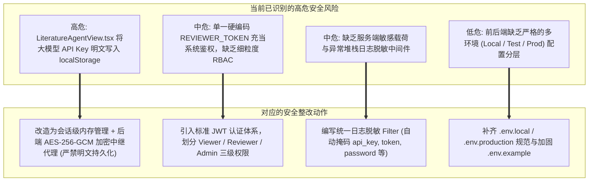

# PhaseChangeDB 重构与安全整改清单 (Security & Refactoring Backlog)

- **版本**：v1.0
- **日期**：2026-09-19
- **定位**：指导 PhaseChangeDB 从当前 MVP 向生产就绪架构演进的安全合规加固与代码重构执行清单。

---

## 1. 密钥安全与敏感凭据审计

### 1.1 Git 历史与泄密排查结论
- **Git 历史提交排查**：
  - 执行 `git log --all --full-history -- "**.env"` 与正则敏感模式扫描，确认**历史上从未向代码仓库提交过真实的 `.env` 文件**；
  - 核心密码（如 MySQL root 密码、生产密钥）未在代码注释或配置文件中硬编码泄露；
  - 结论：**当前 Git 历史干净，无紧急密钥吊销与历史清洗需求**。

### 1.2 现存严重安全风险与整改方案



#### 风险 1（高危 P0）：前端 `localStorage` 明文存储用户大模型 API Key
- **现状代码**：`frontend/src/components/LiteratureAgentView.tsx` 第 125 行：
  ```typescript
  localStorage.setItem(LOCAL_STORAGE_LLM_KEY, JSON.stringify(newConfig)) // 包含明文 apiKey!
  ```
- **危害**：同源下的任何第三方脚本、浏览器插件或潜在 XSS 注入均可轻易读取 `localStorage`，直接盗取用户的 Gemini / DeepSeek / OpenAI API 密钥；
- **整改措施**：
  1. 彻底删除前端 `localStorage` 写入密钥的代码，清空本地存储；
  2. 用户在界面填入的 API Key 仅保存在当前 React 会话内存中，页面刷新即失效；
  3. 若用户需要跨设备或持久化保存，前端调用后端安全凭据存储接口 `POST /v1/user/credentials`，后端使用主密钥（`PCM_SECRET_KEY`）通过 **AES-256-GCM** 算法加密后存入数据库或带 TTL 的 Redis；
  4. 推理请求由后端统一中继代理（BFF 模式），严禁前端浏览器直连模型厂商服务，杜绝控制台网络监控抓包。

#### 风险 2（中危 P1）：鉴权缺乏多角色细粒度控制 (RBAC)
- **现状代码**：仅通过单个环境变量 `PCM_REVIEWER_TOKEN` 进行 HTTP Bearer 认证；
- **整改措施**：
  1. 引入标准 JWT 访问令牌，支持三种角色：
     - `Viewer`：匿名或普通用户，仅具备只读检索与物性对比权限；
     - `Reviewer`：专业审核员，具备提取候选审核与 Observation 状态流转权限；
     - `Admin`：超级管理员，具备全局系统配置与用户授权管理权限；
  2. FastAPI 端引入标准安全依赖：`Security(get_current_active_user, scopes=["review:write"])`。

#### 风险 3（中危 P1）：缺少日志脱敏机制
- **整改措施**：
  1. 编写标准 Logging Formatter / Filter，全局拦截所有日志输出；
  2. 对常见敏感键名（`api_key`、`token`、`secret`、`password`、`authorization`）执行掩码处理（如保留首 4 位与末 3 位，中间使用 `••••••` 替换）；
  3. 在统一异常处理器中，生产环境下严格隐藏底层数据库报错详情与 SQL 语句，统一返回 RFC 7807 规范脱敏错误。

---

## 2. 架构治理与重构执行清单 (Backlog)

| 编号 | 模块分类 | 任务名称 | 优先级 | 影响范围 | 回滚策略 |
| :--- | :--- | :--- | :--- | :--- | :--- |
| **SEC-01** | 安全整改 | **前端 API Key 明文清除与会话化** | **P0** | `frontend/src/components/LiteratureAgentView.tsx` | 清除 localStorage 逻辑，若异常可保留临时内存状态 |
| **SEC-02** | 安全整改 | **后端大模型安全代理与 AES-256 加密** | **P0** | `app/core/crypto.py`, `app/api/agent.py` | 代理接口为新增，不影响既有业务路由 |
| **SEC-03** | 安全整改 | **请求日志全链路敏感字段掩码脱敏** | **P1** | `app/core/logging.py`, `app/main.py` | 降级为原生标准日志输出 |
| **SEC-04** | 安全整改 | **JWT 角色权限体系 (RBAC) 建设** | **P1** | `app/core/security.py`, `app/api/workflow.py` | 保持兼容老 `PCM_REVIEWER_TOKEN` 降级校验 |
| **REF-01** | 后端重构 | **拆分 2242 行超级类 `MySQLCatalogRepository`** | **P0** | `app/infrastructure/` 下拆分子仓储 | 原类作为 Facade 保持外部接口不变，平滑代理 |
| **REF-02** | 后端重构 | **应用服务层抽离与用例独立编排** | **P1** | `app/application/` 下新增各个 Domain Service | 老路由继续调用应用服务，对外接口零改动 |
| **REF-03** | 后端重构 | **拆分 `app/api/mvp.py` 杂糅路由** | **P1** | `app/api/materials.py`, `app/api/analytics.py` 等 | 在 `mvp.py` 中保留路由别名重定向（307 或直接引用） |
| **REF-04** | 后端重构 | **解耦 `literature_parser.py` 正则扫描器** | **P1** | `app/infrastructure/parsers/` | 接入 `pypdf` + `CrossrefClient`，保留原正则为最终回退 |
| **FE-01** | 前端重构 | **拆分 2108 行巨型组件 `App.tsx`** | **P0** | `frontend/src/views/` (拆分 5 大视图) | `App.tsx` 改为纯路由入口分发器，保留原有 UI 结构 |
| **FE-02** | 前端重构 | **统一构建前端 API Client 统一请求层** | **P1** | `frontend/src/api/client.ts` | 替换散落在各组件中的裸 `fetch`，统一错误通知 |
| **FE-03** | 前端重构 | **拆分 82KB 巨型 `App.css` 为模块化样式** | **P1** | `frontend/src/` 各组件配套样式 | 保留公用全局 reset，其余迁移至局部样式 |
| **FE-04** | 前端重构 | **引入 TanStack Query 统一管理服务端状态** | **P2** | 前端数据加载与缓存 | 组件逐个迁移，老组件保持 `useEffect` 正常工作 |

---

## 3. 分阶段实施路线与验收准则

### 第一阶段：安全红线清除（预计耗时：1~2 人天）
- [ ] 移除前端 `localStorage` 保存 `apiKey` 逻辑；
- [ ] 增加后端加解密模块 `app/core/crypto.py`；
- [ ] 增加大模型服务端调用中继端点 `/v1/agents/literature-parser/proxy`；
- [ ] 完善 `.env.example` 与日志掩码过滤器；
- [ ] **验收准则**：通过浏览器控制台与 Storage 面板检查无任何敏感 Key，后端日志无明文 Token。

### 第二阶段：后端上帝类下沉解耦（预计耗时：2~3 人天）
- [ ] 在 `app/infrastructure/repositories/` 中创建 `MySQLMaterialRepository` 等 5 个子仓储；
- [ ] `MySQLCatalogRepository` 改写为轻量 Facade 委托调用；
- [ ] 拆分 `app/api/mvp.py`，将路由按领域分发至对应的模块中；
- [ ] **验收准则**：运行 `PCM_INTEGRATION=1 uv run pytest`，全部 33 项已有测试 100% 绿色通过，API 响应无任何差异。

### 第三阶段：前端视图分离与 API Client 治理（预计耗时：2 人天）
- [ ] 封装统一 `frontend/src/api/client.ts`；
- [ ] 将 `App.tsx` 拆分为 `MaterialsView`、`PropertyComparisonView` 等 5 个独立组件；
- [ ] 拆分 `App.css`；
- [ ] **验收准则**：`pnpm lint`、`pnpm typecheck`、`pnpm build` 无警告无报错，前端交互体验丝滑一致。
