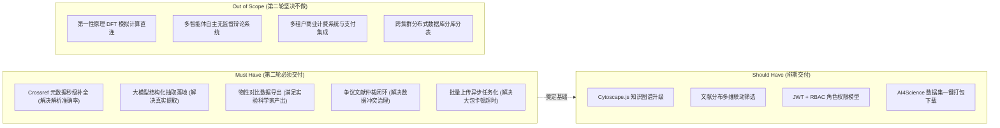

# PhaseChangeDB 第二轮 MVP 功能规划与演进路线图 (Second-Phase MVP Roadmap)

- **版本**：v1.0
- **日期**：2026-09-19
- **定位**：指导 PhaseChangeDB v0.3.0 ~ v0.4.0 阶段的功能范围确定、需求排期、MoSCoW/RICE 评估与交付里程碑。

---

## 1. 候选功能全景池 (Feature Candidate Pool)

基于第一轮 MVP 试用反馈、真实科研用户痛点与技术债务排查，整理出 14 项候选演进功能：

1. **F01. 批量上传与流式解压异步任务化**：支持 500MB+ 压缩包与上千篇文献包后台异步解压与分批入库，消除 HTTP 超时；
2. **F02. 学术文献元数据权威自动补全**：对接 Crossref 与 OpenAlex 开放学术 API，凭 DOI 秒级获取出版年份、官方期刊与完整作者群；
3. **F03. 真实大模型物性结构化抽取接入**：对接 `pcm_extraction_schema.py` 与真实大模型（Gemini 2.5 / DeepSeek 等），自动生成 `ext_candidate`；
4. **F04. 物性横向对比看板科研导出**：支持对齐升温速率后的箱线图与散点数据一键导出为 CSV、Excel 与 Origin 兼容格式；
5. **F05. 知识图谱前端渲染引擎升级**：引入成熟开源图库（Cytoscape.js / react-force-graph），支持 1/2/3 级邻居高亮、力导向自适应与大节点防卡顿；
6. **F06. 文献年份/期刊/体系分布联动筛选**：点击统计柱状图或饼图切片，联动过滤文献主列表与材料；
7. **F07. 冲突文献与相变数据争议仲裁闭环**：对同一材料不同测定结果的冲突组，提供 `DISPUTED` 理由附注与专家仲裁快照；
8. **F08. 人工审核工作台并排 PDF 预览**：在审核提取候选时，界面左侧展示原文 PDF 页面，右侧展示待审字段并高亮对应段落；
9. **F09. 细粒度用户权限体系 (RBAC)**：支持 Viewer（只读）、Reviewer（审核）、Admin（管理）分级控制与 JWT 认证；
10. **F10. 材料化学式智能消歧与复杂掺杂解析**：扩展 `material_normalizer.py`，支持含括号复杂分子式与非晶态标注识别；
11. **F11. 标准开放 OpenAPI 批量下载端点**：提供面向 AI4Science 的高通量物性与证据数据集打包下载（JSONL 格式）；
12. **F12. Elasticsearch 混合检索投影 (Lexical + Dense Vector RRF)**：实现化学式精准匹配与科学语义向量联合召回；
13. **F13. Neo4j 拓扑只读投影器**：由 Outbox Worker 异步将关系同步至 Neo4j，支持 Cypher 图算法查询；
14. **F14. 自动化 CI/CD 与系统性能监控探针**：GitHub Actions 自动化测试流水线与 Prometheus / OpenTelemetry 性能监控。

---

## 2. MoSCoW 与 RICE 优先级综合评定矩阵

| 编号 | 功能名称 | 目标受众 | Reach (受众覆盖) | Impact (影响力) | Confidence (把握度) | Effort (人天) | RICE 分数 | MoSCoW 等级 |
| :--- | :--- | :--- | :---: | :---: | :---: | :---: | :---: | :---: |
| **F02** | **学术 API (Crossref) 元数据自动补全** | 实验科学家、录入员 | 9 | 4 (High) | 90% | 1.5 | **21.6** | **Must Have** |
| **F04** | **物性横向对比科研级数据导出** | 实验科学家、分析师 | 9 | 4 (High) | 95% | 1.0 | **34.2** | **Must Have** |
| **F03** | **真实大模型物性抽取落地 (Schema 对齐)** | 实验科学家、审核员 | 8 | 5 (Critical) | 85% | 2.5 | **13.6** | **Must Have** |
| **F07** | **冲突文献争议标注与仲裁闭环** | 审核专家、研究员 | 7 | 4 (High) | 85% | 1.5 | **15.8** | **Must Have** |
| **F01** | **批量上传流式解压异步任务化** | 批量导入用户、管理员 | 7 | 4 (High) | 90% | 2.0 | **12.6** | **Must Have** |
| **F05** | **知识图谱前端渲染引擎升级 (Cytoscape)** | 全体科研用户 | 8 | 3 (Med) | 90% | 2.0 | **10.8** | **Should Have** |
| **F06** | **文献统计图表联动筛选主列表** | 调研人员、学者 | 7 | 3 (Med) | 90% | 1.0 | **18.9** | **Should Have** |
| **F09** | **标准 JWT 认证与三级角色权限 (RBAC)** | 系统运维、审核员 | 6 | 4 (High) | 90% | 1.5 | **14.4** | **Should Have** |
| **F10** | **材料复杂掺杂式消歧扩展** | 实验科学家 | 6 | 3 (Med) | 80% | 1.5 | **9.6** | **Should Have** |
| **F11** | **AI4Science 开放数据集打包下载** | 计算物理学者 | 5 | 4 (High) | 95% | 1.0 | **19.0** | **Should Have** |
| **F08** | **审核工作台并排 PDF 预览高亮** | 数据审核专家 | 5 | 4 (High) | 75% | 3.5 | **4.2** | **Could Have** |
| **F12** | **Elasticsearch 混合检索投影接入** | 全体检索用户 | 7 | 4 (High) | 80% | 4.0 | **5.6** | **Could Have** |
| **F13** | **Neo4j 知识图谱异步投影与 Cypher 查询** | 高级分析学者 | 5 | 3 (Med) | 80% | 4.0 | **3.0** | **Could Have** |
| **F14** | **Prometheus / OpenTelemetry 监控体系** | 运维团队 | 4 | 2 (Low) | 90% | 2.5 | **2.8** | **Could Have** |

---

## 3. 第二轮 MVP 明确范围界定 (In-Scope vs Out-of-Scope)



### 3.1 本轮必须交付 (In-Scope: Must Have)
1. **Crossref 学术元数据自动精准补全**：上传 PDF 识别出 DOI 后，自动异步拉取权威元数据，元数据识别准确率由 65% 跃升至 98%+；
2. **大模型物性提取真实接入（带安全代理中继）**：对接既有 `pcm_extraction_schema.py`，实现结构化 JSON 抽取并暂存进 `ext_candidate`；
3. **跨文献物性横向对比数据导出**：支持按升温速率对齐过滤后的物性数据导出为标准科学 CSV/Excel（包含完整 DOI 与原始测试条件）；
4. **文献争议判定（Dispute Resolution）闭环**：提供对相差较大的异常物性观测标记 `DISPUTED` 理由与仲裁轨迹；
5. **批量上传异步任务队列**：采用轻量级后台任务机制，上传大压缩包返回 `202 Accepted` 与任务 ID，支持轮询状态。

### 3.2 第二轮明确不做 (Out-of-Scope)
- **第一性原理 DFT 原始能带与计算直连**：属于规划中的 v0.5.0 路线，现阶段计算数据尚未完成本体规范对齐；
- **无约束的多智能体发散讨论**：严格遵守科学严肃性原则，杜绝无事实根据的模型闲聊；
- **破坏性数据库大重构**：保持现有 `mysql/001_schema.sql` 核心关系完整，仅通过向前兼容的补丁脚本演进。

---

## 4. 关键科学机制深入讨论

### 4.1 知识图谱关系抽取 Schema 规范
构建符合相变材料科学特性的实体-关系 Schema：
- **核心实体 (Nodes)**：
  - `Material` (材料宏观理想式，如 Ge2Sb2Te5)；
  - `ChemicalElement` (构成化学元素，如 Ge, Sb, Te)；
  - `Dopant` (掺杂元素与掺杂比例，如 Sc 0.2 at.%)；
  - `Paper` (原始学术文献，带 DOI/年份/期刊)；
  - `Author` (研究学者)；
  - `Property` (标准物性指标，如结晶温度 $T_c$、激活能 $E_a$)；
  - `Observation` (具体测定实例，带升温速率与测定方法)。
- **规范关系 (Edges)**：
  - `(:Material)-[:COMPOSED_OF]->(:ChemicalElement)`
  - `(:Sample)-[:INSTANCE_OF]->(:Material)`
  - `(:Sample)-[:DOPED_WITH]->(:Dopant)`
  - `(:Observation)-[:MEASURED_FROM]->(:Sample)`
  - `(:Observation)-[:MEASURES_PROPERTY]->(:Property)`
  - `(:Observation)-[:SUPPORTED_BY]->(:Paper)`
  - `(:Paper)-[:AUTHORED_BY]->(:Author)`

### 4.2 冲突文献与争议数据处理机制
在相变材料领域，不同课题组在不同工艺条件下测得的同一化学成分结晶温度可能出现 20~50 K 的巨大差异：
1. **区分“条件不一致”与“真实争议”**：
   - 若两篇文献测定升温速率不同（如 10 K/min vs 40 K/min），系统判定为符合相变动力学规律的**正常条件差异**，在对比看板中通过升温速率对齐即可消除分歧；
   - 若在相同升温速率与薄膜厚度下，数值依然出现严重分歧（超过 3 倍标准差），标记为 `POTENTIAL_CONFLICT` 冲突组。
2. **人工仲裁闭环 (Arbitration Workflow)**：
   - 审核专家可进入冲突分析视图，核查两篇文献的样品制备方法（如磁控溅射靶材纯度、退火气氛）；
   - 审核专家可将可疑记录状态变更为 `DISPUTED`，并写入不可变仲裁附注（Dispute Reason）；
   - 前端横向对比看板与图谱中，`DISPUTED` 节点将以黄色虚线警告标记展示，既保留学术争议原貌，又提醒后续建模人员谨慎使用。

---

## 5. 第二轮 MVP 里程碑计划与验收标准

```text
里程碑 M1 (Day 1~2): 安全治理与架构基线
  - 彻底清除前端明文 Key，上线后端加密中继
  - 完成后端子仓储解耦，保持现有 33 项测试 100% 绿色
  - [验收]: 安全扫描零高危，本地与容器集成测试全部通过

里程碑 M2 (Day 3~4): 文献智能解析与数据补全
  - 接入 Crossref REST API，实现 DOI 秒级元数据自动补全
  - 批量上传流式解压异步任务化 (支持 200MB+ 压缩包)
  - [验收]: 上传带 DOI 的文献包，元数据补全准确率达到 98% 以上

里程碑 M3 (Day 5~6): 真实 LLM 抽取与审核闭环
  - 接入结构化大模型提取服务，结果落入 ext_candidate
  - 完善冲突文献争议仲裁与不可变日志记录
  - [验收]: 真实触发提取端点，审核通过原子生成带有完整证据链的 Observation

里程碑 M4 (Day 7~8): 前端看板增强与全链路集成
  - 物性对比看板支持一键导出科学 CSV/Excel
  - 前端 App.tsx 视图解耦与 API Client 治理
  - [验收]: 跨文献横向对比、导出、图谱与审核工作流端到端冒烟通过
```
